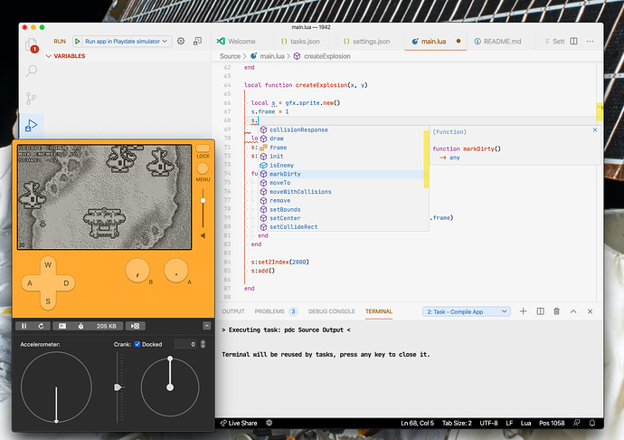

# VS Code Playdate

Only really adds the ability to hit "Run" and trigger opening the sim, but has docs on how to set up the Lua extension



### Getting Set Up

1. Go to your Playdate game
1. Add the SDK library to the Lua extension by adding/editing `.vscode/settings.json`

```diff
{
  "Lua.diagnostics.globals": ["playdate", "import"],
  "Lua.workspace.library": {
    "/Users/ortatherox/Developer/PlaydateSDK/CoreLibs": true
  }
}
```

Change my name to yours too...

1. Add a compile task by creating `.vscode/tasks.json`

```json
{
	"version": "2.0.0",
	"tasks": [{
			"label": "Compile App",
			"command": "pdc",
			"args": ["Source", "Output"],
			"type": "shell"
	}]
}
```

This runs `pdc Source Output`.

1. Add a launch task by creating `.vscode/launch.json`:

```json
{
  // Use IntelliSense to learn about possible attributes.
  // Hover to view descriptions of existing attributes.
  // For more information, visit: https://go.microsoft.com/fwlink/?linkid=830387
  "version": "0.2.0",
  "configurations": [
    {
      "request": "launch",
      "type": "playdate",
      "name": "Run app in Playdate simulator",
      "preLaunchTask": "Compile App",
      "source": "${workspaceFolder}/Source",
      "output": "${workspaceFolder}/Output",
    }
  ]
}
```

That's it, you get auto-completion and the ability to hit a command to trigger loading it into the sim.

### Notes

The playdate version of Lua has a few extras:

- The `import` function
- `+=` and `-=` 

Both of these don't exist in normal Lua, so `import` is declared as a global, and I've been converting `+=` to the long form `x = x + 1`.
